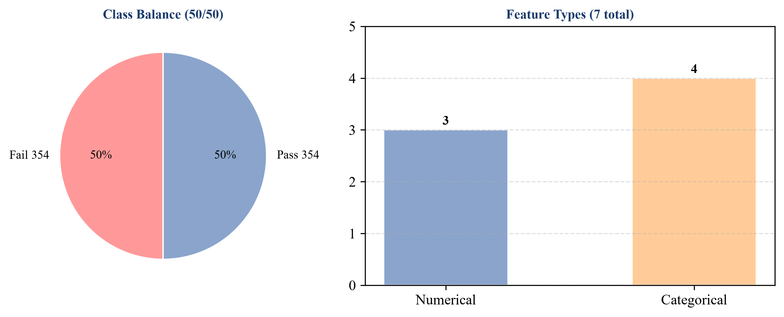
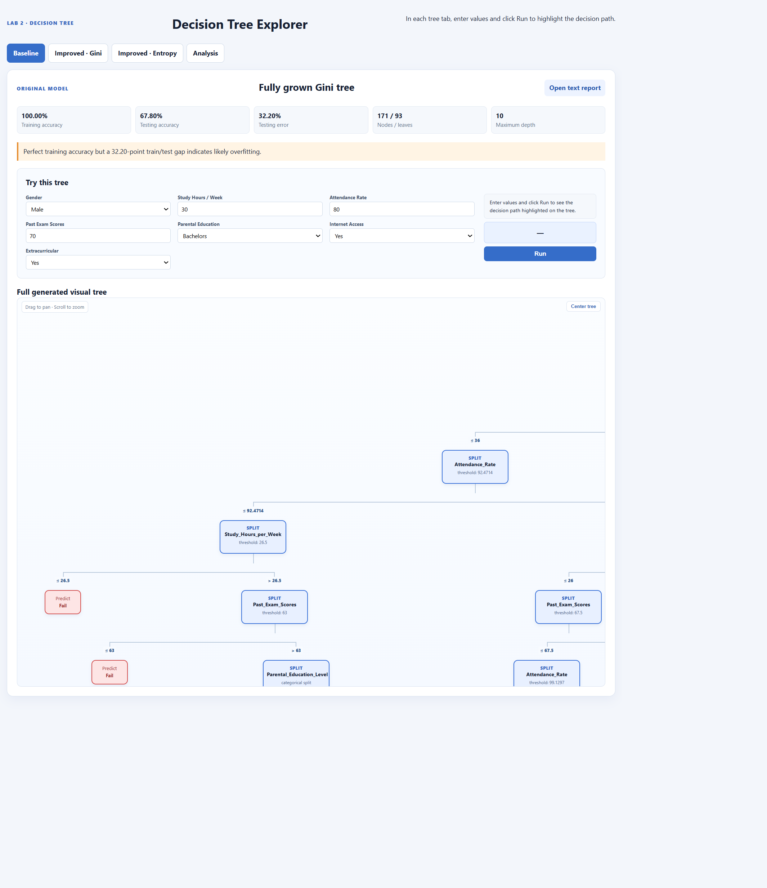
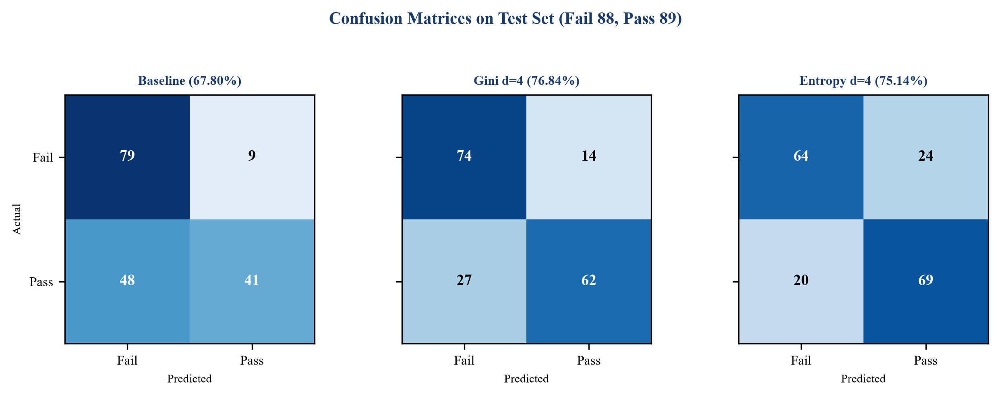
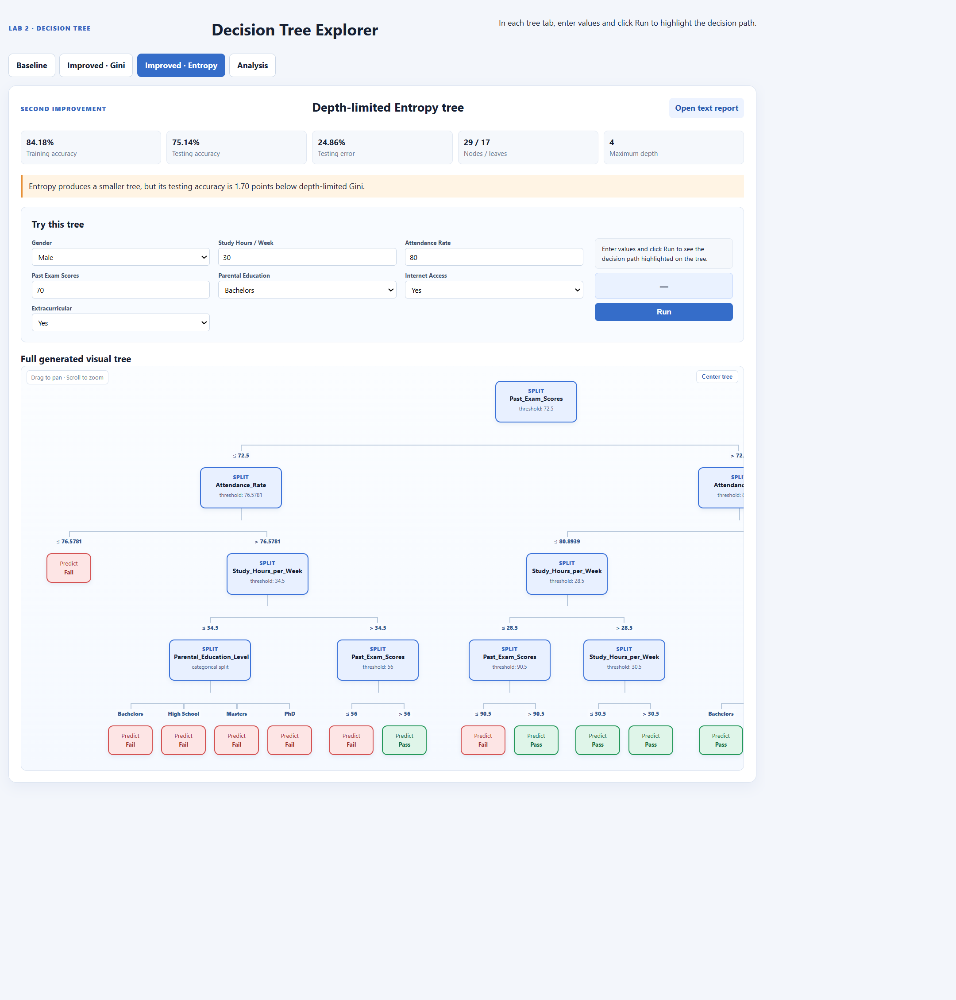
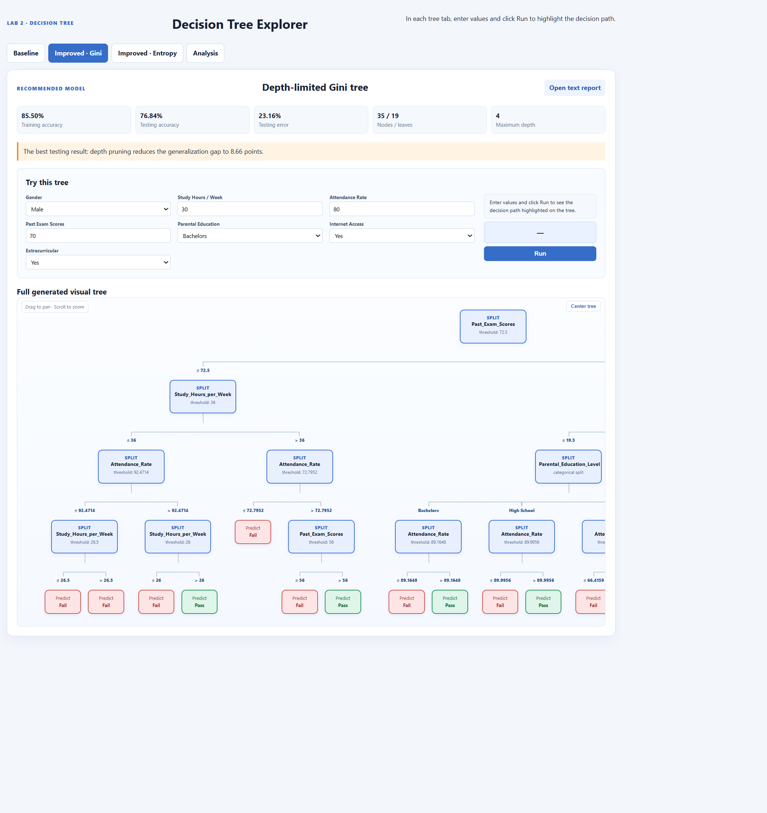
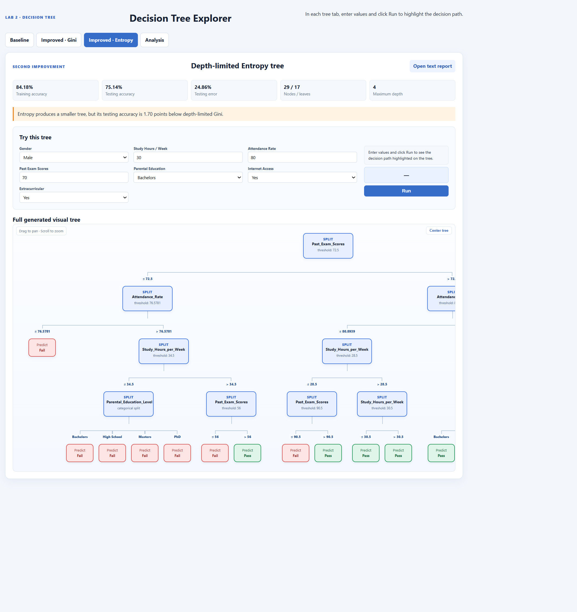
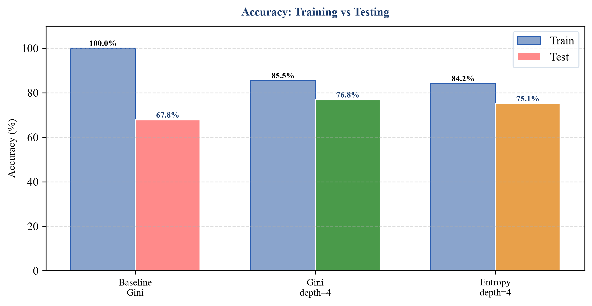
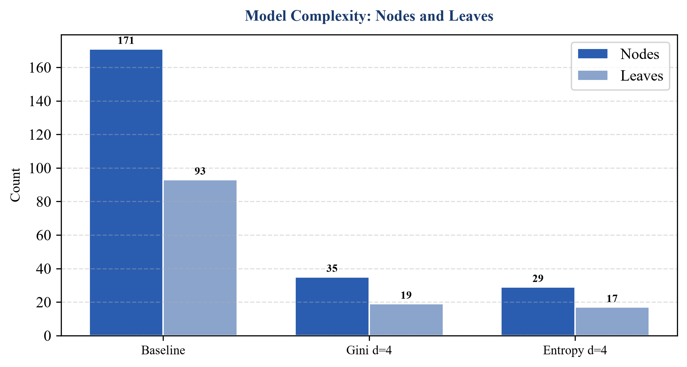
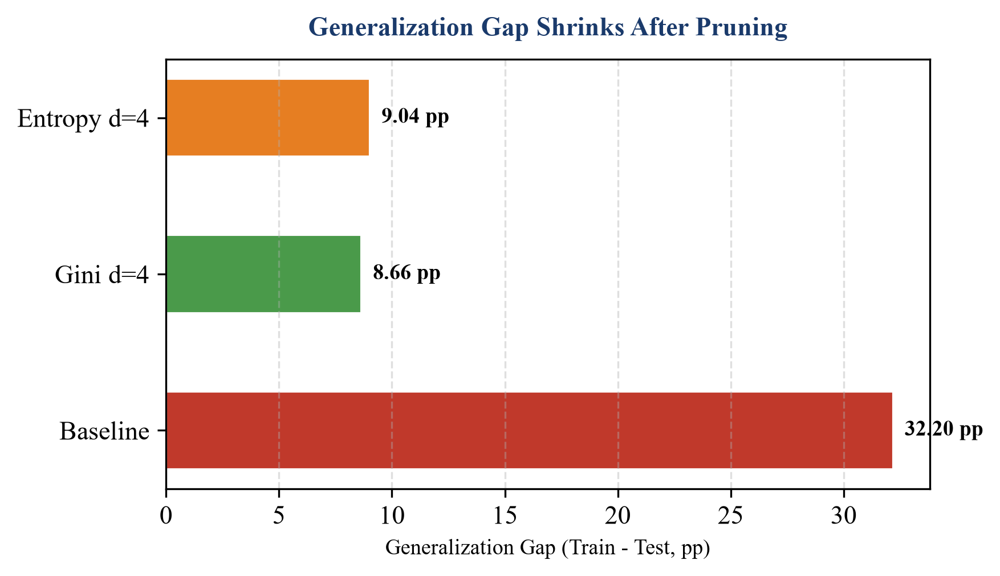

# Lab 2 — Decision Tree Modeling and Improvement
### GROUP 6 — Class 24C03 — Introduction to Artificial Intelligence, HCMUS

**Repository:** https://github.com/AdrianParry-17/AI-Lab-Decision-Tree

---

## a. Group Introduction

| No. | Student ID | Full Name | Contribution |
|-----|------------|-----------|--------------|
| 1 | 24127345 | Nguyễn Minh Đức | Visualize decision tree, Analysis of the resulting tree |
| 2 | 24127346 | Văn Phú Đức | Video presentation |
| 3 | 24127385 | Huỳnh Minh Hùng | Train decision tree, Build model, Model improvement |
| 4 | 24127388 | Hy Huê Hưng | Dataset selection & Description, Report writing |

The contributions above reflect the group's final task allocation.

---

## b. Introduction

### Decision Trees

A decision tree is a non-parametric supervised learning model that recursively partitions the data by choosing the attribute and threshold that best reduces impurity. Two common impurity measures for classification are Gini impurity ($Gini = 1 - \sum p_i^2$) and Entropy ($Entropy = -\sum p_i \log_2 p_i$). At each node the algorithm tests all possible splits and selects the one that minimizes weighted impurity. Splitting stops when a node becomes pure, no useful split remains, or a stopping criterion such as maximum depth is reached. Each leaf predicts the majority class of its training samples, so every root-to-leaf path can be read as an intuitive if-then rule.

Decision trees are especially attractive because they are interpretable, handle both numerical and categorical features without scaling, and capture non-linear, conditional relationships.

### Project Objective

The objectives of this lab are to understand how a decision tree works, apply it to a real dataset, evaluate its performance with appropriate metrics, analyze the resulting tree, propose and test two to three improvements, and practice technical writing and teamwork. This report presents the dataset, the baseline tree, its analysis, two improvement methods, a comparison of results, and conclusions.

---

## c. Dataset Description

### Source

The dataset used in this project is the public **Student Performance Prediction** dataset from Kaggle: https://www.kaggle.com/datasets/amrmaree/student-performance-prediction. A local copy is stored as `data/student_data.csv` in the repository for reproducibility. The dataset is provided under the Kaggle public datasets program and satisfies the assignment's requirement for a reliable public source (Kaggle Datasets).

The task is binary classification: predicting whether a student will Pass or Fail.

### Samples, Features and Target

**Samples**

| Statistic | Count |
|-----------|-------|
| Total rows | 708 |
| Distinct records | 500 |
| Duplicate rows (oversampled) | 208 |
| Training set (75%) | 531 rows (375 distinct) |
| Testing set (25%) | 177 rows (125 distinct) |
| Missing values | 0 |

The data is split in a stratified manner with seed 42, keeping duplicate records grouped together to avoid leakage between training and testing sets. Verification shows zero overlap of distinct records between the two partitions. The dataset contains 208 duplicate rows from oversampling (708 total vs 500 distinct). If duplicates were split randomly without grouping, identical records could appear in both train and test, inflating test accuracy and hiding overfitting. Grouping prevents this leakage.

The overall dataset is perfectly balanced, with equal numbers of Fail and Pass samples. The training and testing partitions are nearly balanced:

| Partition | Fail | Pass | Total |
|-----------|------|------|-------|
| Overall | 354 (50.0%) | 354 (50.0%) | 708 |
| Training | 266 (50.1%) | 265 (49.9%) | 531 |
| Testing | 88 (49.7%) | 89 (50.3%) | 177 |


*Figure 1 — Dataset overview: balanced classes and feature types.*

**Features**

The original CSV has 10 columns. After preprocessing, two columns are excluded: `Student_ID` (identifier) and `Final_Exam_Score` (directly determines Pass/Fail and would cause leakage).

The remaining 7 features used for modeling are:

| Column | Type | Description |
|--------|------|-------------|
| Gender | Categorical | Male, Female |
| Study_Hours_per_Week | Numerical | 10–39, mean Pass 28.8, Fail 23.5 |
| Attendance_Rate | Numerical | 50.1–99.9, mean Pass 83.6, Fail 72.6 |
| Past_Exam_Scores | Numerical | 50–100, mean Pass 84.2, Fail 71.6 |
| Parental_Education_Level | Categorical | High School, Bachelors, Masters, PhD |
| Internet_Access_at_Home | Categorical | Yes / No |
| Extracurricular_Activities | Categorical | Yes / No |

Target variable: `Pass_Fail` with two classes, Pass and Fail.

### Preprocessing

1. Validate the header and required columns.
2. Remove `Student_ID` and `Final_Exam_Score`.
3. Convert numerical columns to int/float and keep categorical columns as strings. The custom decision-tree implementation handles categorical strings directly via value-based splits, which branch on exact string equality. This avoids the need for one-hot or label encoding.
4. Check for missing values.
5. Perform a stratified 75/25 split with seed 42, keeping duplicate records grouped together.
6. No additional scaling or encoding is needed for this implementation.

### Why This Dataset Fits Decision Trees

This dataset is well suited for decision trees. It is a classification problem where interpretability matters — teachers and students benefit from clear rules such as *if Past <= 72.5 and Hours <= 36 then Fail*. It contains mixed numerical and categorical features with natural thresholds, which the custom tree handles directly via threshold splits for numerical features and value splits for categorical strings. Study time and attendance interact conditionally with past scores, and trees model such non-linear interactions naturally. The size is moderate (708 rows, 500 distinct), large enough to learn patterns but small enough to visualize the tree and clearly demonstrate the effect of depth limiting (from 171 nodes depth 10 to 35 nodes depth 4). The overall balanced, clean data with a clear leakage example also makes it suitable for teaching feature selection and pre-pruning.

---

## d. Baseline Model

### Model Description

- Algorithm: Classification decision tree using weighted Gini impurity.
- Maximum depth: None (fully grown).
- Stopping condition: Node is pure or no split improves impurity. Depth limiting is implemented as pre-pruning via a maximum-depth stopping criterion.
- Number of features: 7.

### Training and Testing Procedure

The same pipeline is used for all experiments: load the data, split into training (75%) and testing (25%) sets with seed 42 using a duplicate-group aware stratified split, train the tree, and evaluate on both sets. Keeping the split identical isolates the effect of model changes.

- Training: 531 rows (375 distinct) — Fail 266, Pass 265
- Testing: 177 rows (125 distinct) — Fail 88, Pass 89

Reproduction from the repository root:

```
python -m src.pure
python -m src.depth
python -m src.depth_cri
```

These commands generate the result files and the interactive visualization.

### Resulting Tree

The baseline tree has 171 nodes, 93 leaves, and a maximum depth of 10. Its root split is `Past_Exam_Scores <= 72.5`.

- If Past_Exam_Scores <= 72.5, the tree splits on Study_Hours_per_Week and then Attendance_Rate, with deeper levels using Parental_Education and Gender.
- If Past_Exam_Scores > 72.5, it splits on Study_Hours_per_Week and then uses Parental_Education, Attendance_Rate, and other categorical features at deeper levels.

The excerpt below shows the top levels. The full tree is provided in the appendix and as an interactive visualization.


*Figure 2 — Excerpt of the baseline fully grown tree (171 nodes, depth 10, root Past <= 72.5). Full tree in appendix and interactive version in docs/tree_visualization.html.*

For reference, a schematic overview is also generated:


*Figure 2b — Schematic overview of baseline tree structure.*

### Accuracy and Error Rate

| Dataset | Correct | Incorrect | Accuracy | Error Rate |
|---------|---------|-----------|----------|------------|
| Training | 531/531 | 0/531 | 100.00% | 0.00% |
| Testing | 120/177 | 57/177 | 67.80% | 32.20% |

Confusion matrices (rows = Actual, columns = Predicted):

**Training:**

| Actual \ Predicted | Fail | Pass |
|--------------------|------|------|
| Fail | 266 | 0 |
| Pass | 0 | 265 |

**Testing:**

| Actual \ Predicted | Fail | Pass |
|--------------------|------|------|
| Fail | 79 | 9 |
| Pass | 48 | 41 |

Extended metrics on the held-out test set (computed from hard predictions; ROC-AUC not reported as the custom tree outputs only hard labels without probability scores):

| Class | Precision | Recall | F1-score |
|-------|-----------|--------|----------|
| Fail | 62.20% | 89.77% | 73.49% |
| Pass | 82.00% | 46.07% | 58.99% |
| **Macro avg** | **72.10%** | **67.92%** | **66.24%** |

Balanced accuracy (average recall): 67.92%. Generalization gap: 32.20 percentage points (100.00 - 67.80).


*Figure 3 — Confusion matrices on the held-out test set for the three models (Fail 88, Pass 89).*

---

## e. Analysis of the Resulting Tree

### Overall Structure

The tree is constructed top-down in a greedy manner: at each node the algorithm evaluates all possible categorical value splits and numerical thresholds and chooses the one that most reduces weighted impurity, without backtracking. This local optimum at each node explains why the same root appears in all three models but lower splits diverge. With depth 10 and 93 leaves, the baseline tree is much larger than the depth-limited models, reflecting its tendency to keep splitting until leaves are pure even when splits separate only a few samples.

### Important Decision Rules

1. Past exam score provides the strongest root-level separation under the current settings. The threshold 72.5 was selected as the root split in all three experiments because it yields the largest weighted impurity reduction at the root (Gini/Entropy). Students with Past_Exam_Scores <= 72.5 have a much higher Fail rate in the training data, while those above 72.5 are more likely to Pass, making this the most discriminative single split.
2. Study time is conditional. The threshold for Study_Hours is 36 hours in the low-score branch and 19.5 hours in the high-score branch, showing that the effect of study time depends on past performance. From a domain perspective, students with weaker past scores need substantially more study hours (36) to compensate, while students with strong past scores can pass with fewer hours (19.5) — a conditional interaction that a linear model would miss.
3. Attendance resolves borderline cases. Higher attendance generally leads to Pass within each local branch, but the threshold varies by branch (e.g., 92.47 in the low-score branch vs 74.78 in the high-score branch), indicating attendance is used to distinguish borderline students within each performance group.
4. Deep branches use secondary features. Splits on Gender and other categorical variables at deep levels separate only a few samples and likely capture noise, though this is an interpretation of small leaf size rather than a proven fact. Evidence: baseline has on average only 5.7 training samples per leaf (531/93, 4.0 distinct per leaf), while the depth-limited Gini tree has 27.9 samples per leaf (531/19, 19.7 distinct) and Entropy has 31.2 (531/17, 22.0 distinct) — the increase in samples per leaf after pruning reduces the chance of fitting noise.

### Feature Usage and Impurity Analysis

The baseline tree uses all 7 features but with highly skewed frequency: Attendance_Rate appears 27 times (34.6% of splits), Study_Hours_per_Week 19 times (24.4%), Past_Exam_Scores 14 times (17.9%), Gender 9 times (11.5%), Parental_Education_Level 7 times (9.0%), and Internet_Access_at_Home and Extracurricular_Activities only once each (1.3%). This confirms that numerical features with natural thresholds dominate the early splits, while categorical features are relegated to deep, small leaves. At the root, the Gini impurity drops from 0.5000 (balanced) to a weighted 0.4223 after the Past_Exam_Scores <= 72.5 split (reduction 0.0777; Entropy reduction 0.1161), with the left branch (<=72.5, n=202, Fail 152/Pass 50) and right branch (>72.5, n=329, Fail 114/Pass 215) — a clear separation that explains why this threshold is consistently chosen.

All 93 leaves of the baseline are pure (100% contain only one class), with an average of only 5.7 training samples per leaf (4.0 distinct, min 1, max 75). This extreme purity and fragmentation are direct evidence of memorization rather than generalization.

### Strengths and Weaknesses

**Strengths:** The tree is fully transparent, perfectly fits the training data, has an intuitive root split, and captures conditional interactions.

**Weaknesses:** It is too deep and complex for 7 features (on average fewer than 6 training samples per leaf and 100% pure leaves). The large gap between training (100%) and testing (67.80%) indicates overfitting. It is also biased toward predicting Fail, missing more than half of the passing students.

In summary, the baseline tree was constructed greedily top-down, choosing the locally optimal impurity reduction at each node without global backtracking. This behavior explains the stable root but divergent lower branches, and its overfitting motivates pre-pruning via depth limiting.


*Figure 4 — Analysis view from the interactive visualization.*

---

## f. Improvement Methods

Two improvements were implemented while keeping the data, split, and seed unchanged.

### Improvement 1 — Limiting Maximum Depth (Gini, max_depth = 4) — Pre-pruning

**Method:** The tree is pre-pruned by limiting its maximum depth to 4 using a maximum-depth stopping criterion. All other settings remain the same (Gini impurity).

**Results:**

- Tree shape: 35 nodes, 19 leaves, depth 4 (approximately 79.5% fewer nodes than baseline, 171 -> 35).
- Training: 454/531 correct — 85.50% accuracy, 14.50% error.
- Testing: 136/177 correct — 76.84% accuracy, 23.16% error.


*Figure 5 — Excerpt of the depth-limited Gini tree (35 nodes, depth 4).*


*Figure 5b — Schematic of Gini depth-limited tree.*

Confusion matrix on the held-out test set:

| Actual \ Predicted | Fail | Pass |
|--------------------|------|------|
| Fail | 74 | 14 |
| Pass | 27 | 62 |

Extended metrics: Fail Precision 73.27% Recall 84.09% F1 78.31%; Pass Precision 81.58% Recall 69.66% F1 75.15%; **Macro F1 76.73%**, Balanced accuracy 76.88%.

The pruned tree uses only 4 features: Attendance_Rate 6 times (37.5%), Study_Hours_per_Week 5 times (31.2%), Past_Exam_Scores 4 times (25.0%), and Parental_Education_Level once (6.2%). Gender, Internet and Extracurricular disappear entirely, showing that pruning removes the noisy deep categorical splits. Only 7 of 19 leaves are pure (36.8%), with an average of 27.9 training samples per leaf (19.7 distinct, min 2, max 98) — far more robust than the baseline's 5.7. The root impurity reduction is identical (0.0777 Gini) because the root split is unchanged, confirming the improvement comes from limiting variance, not from a better root.

**Why it improves:** Training accuracy drops to 85.50% but held-out testing accuracy rises by 9.04 points (67.80 -> 76.84) and the generalization gap is reduced from 32.20 to 8.66 points. This is a classic bias-variance trade-off: the fully grown tree has low bias but high variance (memorizes noise in small leaves, 5.7 samples/leaf), while depth limiting (pre-pruning, `max_depth=4`) slightly increases bias but greatly reduces variance by forcing larger leaves (27.9 samples/leaf, 19.7 distinct). Larger leaves average out noise and generalize better, as shown by the reduced gap.

### Improvement 2 — Changing the Splitting Criterion (Gini to Entropy, depth = 4)

**Method:** The depth limit is kept at 4, but the splitting criterion is changed from Gini to Entropy. This isolates the effect of the criterion under the same pre-pruning.

**Results:**

- Tree shape: 29 nodes, 17 leaves, depth 4 — the smallest of the three models.
- Training: 447/531 correct — 84.18% accuracy, 15.82% error.
- Testing: 133/177 correct — 75.14% accuracy, 24.86% error.


*Figure 6 — Excerpt of the depth-limited Entropy tree (29 nodes, depth 4).*


*Figure 6b — Schematic of Entropy depth-limited tree.*

Confusion matrix on the held-out test set:

| Actual \ Predicted | Fail | Pass |
|--------------------|------|------|
| Fail | 64 | 24 |
| Pass | 20 | 69 |

Extended metrics: Fail Precision 76.19% Recall 72.73% F1 74.42%; Pass Precision 74.19% Recall 77.53% F1 75.82%; **Macro F1 75.12%**, Balanced accuracy 75.13%.

The Entropy tree is even more compact: Study_Hours_per_Week 5 times (41.7%), Past_Exam_Scores 3 times (25.0%), Attendance_Rate 2 times (16.7%) and Parental_Education_Level 2 times (16.7%). Only 6 of 17 leaves are pure (35.3%), avg 31.2 samples/leaf (22.0 distinct, min 4, max 78). The smaller size and earlier Attendance splits explain the recall trade-off.

**Why it does not improve overall accuracy:**

| Criterion (depth 4) | Fail recall | Pass recall | Test Accuracy |
|---------------------|-------------|-------------|---------------|
| Gini | 74/88 (84.09%) | 62/89 (69.66%) | 76.84% |
| Entropy | 64/88 (72.73%) | 69/89 (77.53%) | 75.14% |

Both criteria choose the same root split, but Entropy is slightly less effective overall (-1.70 points, 3 more errors). On this nearly balanced dataset (50/50), Gini and Entropy often behave similarly, but Entropy is more sensitive to pure splits and tends to favor splits that create slightly purer children, even if they are smaller. Here this leads to a smaller tree (29 vs 35 nodes, 31.2 vs 27.9 samples/leaf) and an earlier use of Attendance (threshold 76.57 in the low-score branch vs 92.47 for Gini), which helps Pass recall (+7) but harms Fail recall (-10). If identifying Pass is more important, Entropy could still be preferred. Both depth-limited trees outperform the baseline, mainly thanks to pre-pruning.

---

## g. Comparison of Results

| Model | Criterion | Depth | Nodes | Leaves | Depth | Train Acc. | Train Err. | Test Acc. | Test Err. | Gap |
|-------|-----------|-------|-------|--------|-------|------------|------------|-----------|-----------|-----|
| Baseline | Gini | None | 171 | 93 | 10 | 100.00% | 0.00% | 67.80% | 32.20% | 32.20 |
| Depth-limited | Gini | 4 | 35 | 19 | 4 | 85.50% | 14.50% | **76.84%** | **23.16%** | 8.66 |
| Depth-limited | Entropy | 4 | 29 | 17 | 4 | 84.18% | 15.82% | 75.14% | 24.86% | 9.04 |


*Figure 7 — Training versus held-out testing accuracy and generalization gap.*


*Figure 8 — Model complexity (nodes and leaves).*


*Figure 9 — Generalization gap is reduced from 32.20 to 8.66 points after depth limiting (pre-pruning).*

The best performing model on the held-out test set is the depth-limited Gini tree with max_depth = 4 (76.84% test accuracy, 23.16% error). The Entropy tree is slightly smaller but less accurate overall. Terminology is unified as depth-limited / pre-pruned trees.

---

## h. Conclusion

This project shows how decision trees learn thresholds directly from data and how easily a fully grown tree can overfit. The baseline tree achieved 100% training accuracy but only 67.80% on the held-out test set.

Limiting the depth to 4 with pre-pruning proved to be the most effective improvement: it removed 136 nodes (approximately 79.5% fewer nodes, 171 -> 35), reduced the held-out gap from 32.20 to 8.66 points, and raised held-out test accuracy to 76.84%. Changing the criterion from Gini to Entropy at the same depth produced a slightly smaller tree with a different trade-off, but did not beat the Gini pre-pruned tree.

The recommended configuration for this dataset is a Gini tree with max_depth = 4 (76.84% on the held-out test set, 23.16% error, 35 nodes, 19 leaves), offering the best balance between performance and interpretability. With depth limiting (pre-pruning), decision trees reach about 77% on this held-out split, suggesting usefulness for early warning while remaining transparent. This claim is limited to the reported split.

---

## i. References

1. Lab 2 — Decision Tree Modeling and Improvement, HCMUS — Introduction to Artificial Intelligence.
2. Dataset: Amr Maree — Student Performance Prediction, Kaggle Datasets. https://www.kaggle.com/datasets/amrmaree/student-performance-prediction (local copy: `data/student_data.csv`, 708 rows, 500 distinct, 7 features, 2 classes).
3. Breiman, L. et al. — Classification and Regression Trees (1984).
4. Quinlan, J. R. — Induction of Decision Trees (1986) and Mitchell, T. — Machine Learning (1997), Ch. 3 Decision Tree Learning (background on Gini, Entropy, pruning).
5. Scikit-learn Documentation — Decision Trees (for background on Gini/Entropy, not the implementation used).
6. Project implementation: Custom decision-tree framework in `model/` (`tree.py`, `training_strategy.py`) and experiment code `src/utils.py`, `src/pure.py`, `src/depth.py`, `src/depth_cri.py`. Categorical handling via `AttributeValueSplit` branching on string equality; numerical via `AttributeThresholdSplit`.
7. Visualization: `docs/tree_visualization.html` and generated assets `report/assets/` (including `1.png`-`4.png` screenshots and generated charts).

---

## Appendices

### Appendix A — Baseline Tree (detailed excerpt, top 4 levels + leaf statistics)

The full baseline tree has 171 nodes, 93 leaves, depth 10. Below are the top 4 levels (root to depth 3) and leaf summary:

```
Split on Past_Exam_Scores at 72.5
├── If <= 72.5: Split on Study_Hours_per_Week at 36
│   ├── If <= 36: Split on Attendance_Rate at 92.47
│   │   ├── If <= 92.47: Split on Study_Hours_per_Week at 26.5
│   │   │   ├── If <= 26.5: Predict Fail (leaf, ~12 samples)
│   │   │   └── If > 26.5: Split on Past_Exam_Scores at 63 ...
│   │   └── If > 92.47: Split on Study_Hours_per_Week at 26 ...
│   └── If > 36: Split on Attendance_Rate at 72.79 ...
└── If > 72.5: Split on Study_Hours_per_Week at 19.5
    ├── If <= 19.5: Split on Parental_Education_Level ...
    └── If > 19.5: Split on Attendance_Rate at 74.78 ...
Leaf statistics: 93 leaves, avg 5.7 training samples/leaf (4.0 distinct), many leaves with 1–2 samples — evidence of overfitting.
Full text: docs/RESULT_PURE.md (171 nodes, 93 leaves, depth 10). Interactive: docs/tree_visualization.html (Baseline tab) and assets/1.png.
```

### Appendix B — Depth-limited Gini Tree (detailed excerpt)

The Gini tree limited to depth 4 has 35 nodes, 19 leaves, depth 4. Top 4 levels:

```
Split on Past_Exam_Scores at 72.5
├── If <= 72.5: Split on Study_Hours_per_Week at 36
│   ├── If <= 36: Split on Attendance_Rate at 92.47
│   │   ├── If <= 92.47: Split on Study_Hours_per_Week at 26.5
│   │   │   ├── If <= 26.5: Predict Fail
│   │   │   └── If > 26.5: Predict Fail
│   │   └── If > 92.47: Split on Study_Hours_per_Week at 26 ...
│   └── If > 36: Split on Attendance_Rate at 72.79 ...
└── If > 72.5: Split on Study_Hours_per_Week at 19.5
    ├── If <= 19.5: Split on Parental_Education_Level ...
    └── If > 19.5: Split on Attendance_Rate at 74.78 ...
Leaf statistics: 19 leaves, avg 27.9 training samples/leaf (19.7 distinct) — larger, more robust leaves.
Full text: docs/RESULT_DEPTH.md (35 nodes, 19 leaves). Interactive: docs/tree_visualization.html (Gini tab) and assets/2.png.
```

### Appendix C — Depth-limited Entropy Tree (detailed excerpt)

The Entropy tree limited to depth 4 has 29 nodes, 17 leaves, depth 4. Top 4 levels:

```
Split on Past_Exam_Scores at 72.5
├── If <= 72.5: Split on Attendance_Rate at 76.57
│   ├── If <= 76.57: Predict Fail
│   └── If > 76.57: Split on Study_Hours_per_Week at 34.5 ...
└── If > 72.5: Split on Attendance_Rate at 80.89
    ├── If <= 80.89: Split on Study_Hours_per_Week at 28.5 ...
    └── If > 80.89: Split on Study_Hours_per_Week at 19.5 ...
Leaf statistics: 17 leaves, avg 31.2 training samples/leaf (22.0 distinct) — the most compact, earlier Attendance splits.
Full text: docs/RESULT_DEPTH_CRI.md (29 nodes, 17 leaves). Interactive: docs/tree_visualization.html (Entropy tab) and assets/3.png.
```

### Appendix D — Reproduction

```
python -m src.pure
python -m src.depth
python -m src.depth_cri
# Outputs: docs/RESULT_PURE.md, docs/RESULT_DEPTH.md, docs/RESULT_DEPTH_CRI.md
# Assets: python report/assets/generate_assets.py
# Report: typst compile report/Report.typ report/Report.pdf
```

